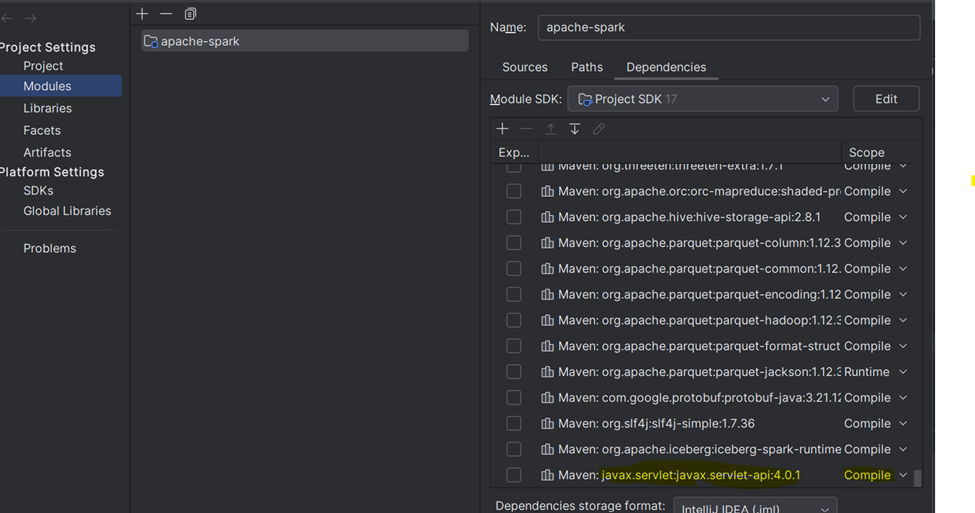
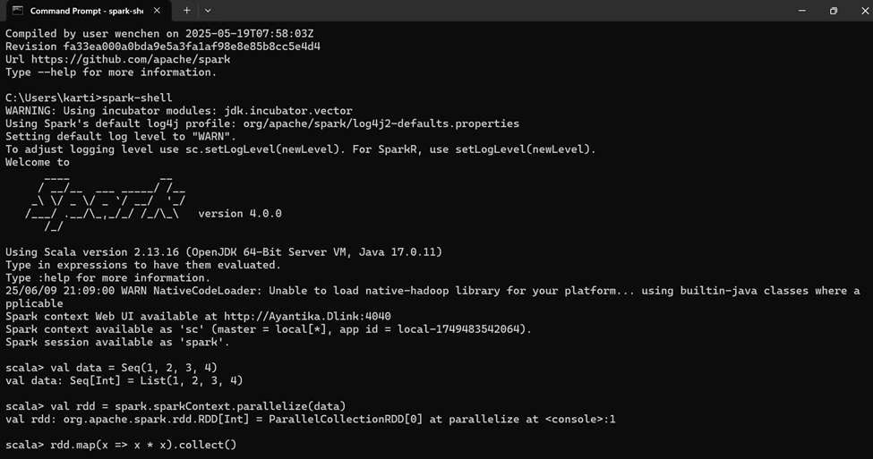

# Getting Started


Here’s a complete guide to set up, configure, and connect Apache Spark using Java code:
________________________________________
Step 1: Spark Setup on Windows
1. Install Prerequisites
   •	Java JDK 8 or 11 or above
   •	Set JAVA_HOME in Environment Variables
2. Download Spark
   •	Go to https://spark.apache.org/downloads
   •	Choose: Pre-built for Apache Hadoop 3.3 and later
   •	Extract it using below command, e.g., C:\spark  
   •	Command     tar -xvzf spark-4.0.0-bin-hadoop3.tgz
3. WinUtils for Windows
   •	Download winutils.exe and hadoop.dll file from: https://github.com/steveloughran/winutils
   •	Place it in C:\hadoop\bin
   •	Set HADOOP_HOME = C:\hadoop in environment variables
4. Set Environment Variables
   •	SPARK_HOME = C:\spark
   •	Add %SPARK_HOME%\bin to Path
   •	Add %HADOOP_HOME%\bin to Path

5. Add javax.servlet-api as runtime dependency in IntelliJ
   •	Open your pom.xml, and add with <scope>compile</scope>:
   xml
  ```<dependency>
   <groupId>javax.servlet</groupId>
   <artifactId>javax.servlet-api</artifactId>
   <version>4.0.1</version>
   <scope>compile</scope> <!-- not provided -->
   </dependency>
   ```


•	Reimport Maven project
Right click your project root → Maven → Reload project.
•	In IntelliJ:
1.	Go to File → Project Structure → Modules → Dependencies tab
2.	Ensure javax.servlet-api-4.0.1.jar is listed as Compile or Runtime scope
      •	Run your app again from IntelliJ.




6. Test
   Step-by-Step to Check Apache Spark from Command Prompt
1. Open Command Prompt
   •	Press Win + R, type cmd, hit Enter.
________________________________________
2. Check Spark Version
   Type the following:
   bash
   spark-shell --version

Expected output:
Welcome to
____              __
/ __/__  ___ _____/ /__
_\ \/ _ \/ _ `/ __/  '_/
/___/ .__/\_,_/_/ /_/\_\   version 4.0.0
/_/

Using Scala version 4.0.0

Using Scala version 4.0.0
If you see this — Spark is installed correctly. 🚀
________________________________________
3. Launch the Spark Shell (Scala Interactive Shell)
   bash
   spark-shell

It should open an interactive Scala shell:
scala
scala> val data = Seq(1, 2, 3, 4)
scala> val rdd = spark.sparkContext.parallelize(data)
scala> rdd.map(x => x * x).collect()
res: Array[Int] = Array(1, 4, 9, 16)

✔️ This confirms Spark is running correctly in standalone local mode.




________________________________________
4. (Optional) Test PySpark
   If you have Python installed:
   bash
   pyspark

Example inside PySpark shell:
python
data = [1, 2, 3]
rdd = sc.parallelize(data)
rdd.map(lambda x: x + 1).collect()

________________________________________


________________________________________
Step 2: Maven Project Setup
pom.xml Dependencies:
xml

```<dependencies>
<dependency>
<groupId>org.apache.spark</groupId>
<artifactId>spark-core_2.12</artifactId>
<version>3.4.1</version>
</dependency>
<dependency>
<groupId>org.apache.spark</groupId>
<artifactId>spark-sql_2.12</artifactId>
<version>3.4.1</version>
</dependency>
</dependencies>
   ```


